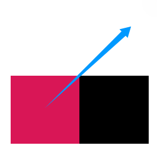
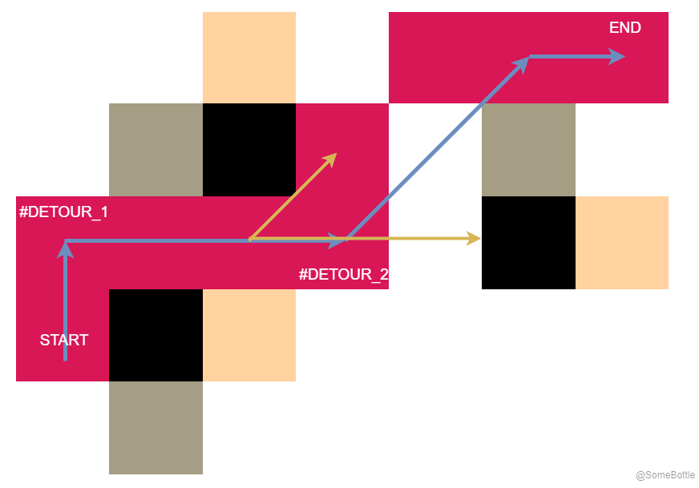
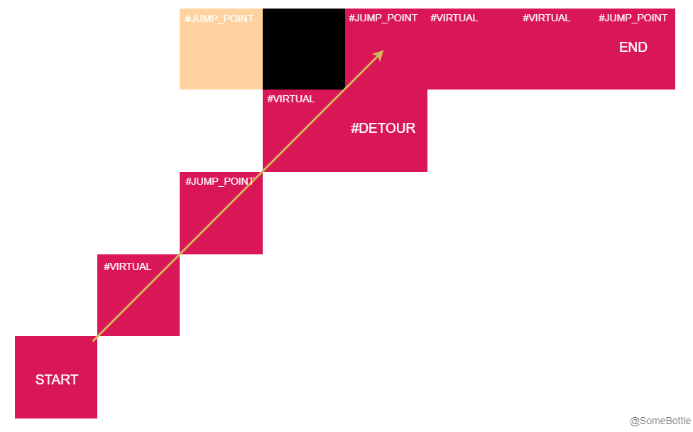

# Path Planning Algorithms (A*, Jump Point Search)

算法课程作业。  

主要是探寻 A* 路径规划算法，咱附带实现了一下 JPS 版本的 A* 算法，支持对角障碍物的阻塞和绕路处理。

* PS：所有代码都有详细注释。

还别说，路径规划真挺有趣吧~ (。・∀・)ノ  

## 0. 展示柜

<video src="./examples/a_star.mp4" controls="controls" width="500" height="300"></video>

<video src="./examples/a_star_jps_detour.mp4" controls="controls" width="500" height="300"></video>


## 1. `./src` 目录结构

```bash
src
├── algorithms # 算法实现
│   ├── __init__.py
│   ├── a_star.py # A* 算法
│   ├── a_star_jps.py # A* 算法 Jump Point Search 版
│   ├── a_star_jps_detour.py # A* 算法 Jump Point Search 版，支持对角障碍绕路
│   ├── a_star_jps_detour_fixed.py # （本仓库中最好的一版算法实现）A* 算法 Jump Point Search 版，支持对角障碍绕路，修正了绕路后的搜索策略，能解得和 A* 一样的路径代价。
│   ├── a_star_jps_detour_failed.py # 失败的绕路实现
│   ├── algorithm_base.py # 算法基类
│   ├── states.py # 算法状态枚举量
│   └── utils.py # 工具类，主要是方向 Direction 相关的类
├── exceptions
│   └── __init__.py # 一些自定义异常
├── problems
│   ├── __init__.py
│   ├── cell_status.py # 图中每个格子状态的枚举量
│   ├── drawer.py # 问题绘制模块
│   ├── generator.py # 随机问题生成
│   ├── problem.py # 问题类，用于表示每个二维栅格图
│   └── utils.py # 工具方法
├── test.py # 一些测试用例
└── visualization
    ├── __init__.py
    ├── algo_animator.py # 算法执行过程动画化模块
    ├── problem_visualizer.py # 将问题进行可视化的模块
    ├── result_visualizer.py # 将求解结果进行可视化的模块
    └── utils.py # 可视化相关的工具方法
```

各个方法的调用方式可以参考 `test.py` 以及各个方法的 docstring 注释。  

## 2. 一些个人心得

### 2.1. 梳理一下

Dijkstra 算法每次迭代中都会从目前**未确定结点中选择路径最短的结点**作为下一个落脚点，然后再扩展其所有的可行邻居结点。虽然 Dijkstra 能**保证找到最短路**，但是因为其扩展的速度特别慢，会均匀地探索各个路径，对于规模很大的图，求解速度实在是令人不敢恭维。

* 注意，Dijkstra **要求边权非负**。

A* 算法则是在 Dijkstra 的基础上，加入了启发式信息（这个信息就是“**是否沿着这个方向更有可能快速到达终点**”），使得其能够**优先扩展更有希望的结点**，从而**加速搜索过程**。

* A* 算法的性能因此也取决于启发式信息的计算方式（**不一定能找到最优路线**），在障碍物比较复杂时可能性能上会退化到 Dijkstra。  

Jump Point Search 优化的 A* 算法则要厉害多了，其通过一些策略大幅减少了**需要扩展的结点**数量，每次扩展的结点是一个“跳点”。

----

💡 从上面也可以看出来，路径规划算法在性能方面一个很重要的点就是——**扩展结点的策略**。

* 扩展结点换个说法，其实就是程序认为**可能存在于最优路径上的结点**。程序会从这些结点出发寻找下一个可能的落脚点。
* 因此迭代过程中**需要扩展的结点越少**，需要检查的结点就越少，算法的内存消耗就越小，同时也能更快求解。

### 2.2. JPS 算法碎碎念

JPS 优化的 A* 算法中最重要的两个概念：

1. 强迫邻居
2. 跳点

具体概念的介绍不多赘述，可以见参考文章。  

个人认为，要清晰地写代码实现 JPS-A* 算法，必须要搞清楚 JPS 的核心优化点在哪里——  
——没错，就是**对扩展结点策略**的优化！  

A* 算法每一次迭代在取出一个落脚点后，都会**扩展其所有邻居结点**；JPS 额外多了一些计算步骤，找到所谓的“跳点”，**扩展的是跳点而不是邻居**，而每次迭代中找到的跳点的数量要明显少很多，因此求解速度明显就要高很多。  

💡 简单来说，JPS 相比 A* 算法，改动的地方其实就是扩展结点的部分（比如在 A* 中就是寻找邻居并加入 `open_list` 这部分）。

## 3. 容易被绕进去的地方

算法实现过程中最让我迷惑的一点：强制邻居（Forced Neighbor）到底是什么个地位？! 到底要不要把强制邻居加入 `open_list` ？很多文章都没讲清楚或没强调这一点。

折腾了好一段时间，总算把 JPS 算法实现后，我的答案是：  

* 不需要加入 `open_list`！ 

强制邻居的作用主要有两个：  

1. 用于判定跳点。（跳点周围肯定有强制邻居）
2. 用于**引导扩展结点**。

第 1 点很多文章都写的很明确，就不多赘述了。主要是第 2 点。  

> 关于 JPS 算法的基础知识这里咱就不多赘述了...(⊙x⊙;)  

### 3.1. 强制邻居是怎么引导扩展结点的？

我觉得整个过程中最让我迷糊的可能就是这个地方了。  

在从 `open_list` 取出一个结点后，在 A* 算法中有 8 个邻居，这其实也可以**看作是 8 个寻找方向**，但在 JPS 算法中，大部分情况下我们并不需要向所有 8 个方向进行搜索。

* 设结点 $x$ 的父（前驱）结点是 $parent(x)$，**所谓的“方向”就是** $parent(x)$ 指向 $x$ 的这个方向。

  
> 图中标出来了 8 个“邻居”的位置，在 JPS 中这是 8 个寻找方向。  

* 上图中是一个起始节点，其没有父结点，因此需要向 8 个方向去查找跳点，将跳点加入 `open_list`。  

也就是从 `open_list` 取出的第二个结点开始，**就全都是跳点了**。

> 当然，把起始结点看作跳点也行。

每个跳点都有路径上的父（前驱）结点，有父结点的结点就有方向。而有方向，JPS 就能顺着方向找跳点，有两种情况：  

1. **水平/竖直方向**。

       

    沿着这个方向**一直走**直到遇到特定的（见参考文章）障碍物，就有了强制邻居（紫色），也就找到了跳点。

2. **对角方向**。

       

    先沿着水平和竖直分量方向按 1 进行，然后再沿着对角线方向走一步。反复这个过程直至遇到特定的（见参考文章）障碍物，就有了强制邻居（紫色），就找到了跳点。

> 特例：终点没有强制邻居。

注意，这里**强制邻居的作用**就来了！  

上面**每个右图**中绿色的结点肯定是从 `open_list` 中取出的跳点，因为其有强制邻居（紫色方块），**设其为点** $A$ ：

1. 对于 1 中的情况，原本从 $A$ 出发找跳点的方向是一直向右，**出现强制邻居后，新增了一个指向强制邻居的寻找方向**。  

2. 对于 2 中的情况，原本从 $A$ 出发找跳点的方向是两个分量和一个对角方向，**出现强制邻居后，新增了一个强制邻居的寻找方向**。  

💡 因此每次取出跳点 $A$ 后的流程如下：

1. 计算这个跳点 $A$ 的方向（ $parent(A) \rightarrow A$ 的这个方向）。  
2. 如果是水平/竖直方向，则从 $A$ 出发有一个寻找方向；如果是对角方向，则从 $A$ 出发有三个寻找方向（见参考文章）。  
3. 扫描一圈检查 $A$ 有几个强制邻居，每找到一个强制邻居，就加上一个寻找方向。  

    * 每个结点最多只有两个强制邻居，比如下面这张图：

          

        > 这里就有 $1+2=3$ 个找跳点的方向。  

4. 沿着这些方向去寻找跳点，将新找到的跳点加入 `open_list`，再进入下一次迭代。  


所以说强制邻居的有引导跳点查找的功能，而 JPS 扩展的是跳点，因此强制邻居其实就是在引导结点的扩展。

## 4. 对角障碍物的处理

### 4.1. 初探

创建算法对象的时候有一个参数 `diagonal_obstacles` 可供配置，默认为 `True`，其决定算法在执行搜索时是否能穿过对角障碍物，类似下面这些情况：  

> Case.1  
>   

> Case.2  
>   
>  

✨ 咱之所以想到添加这个参数，是因为在实际应用中为机器人规划路线时，这样斜着穿过对角障碍物的情况会导致机器人与障碍物发生碰撞。

* 若 `diagonal_obstacles=True`，程序会把这种障碍物考虑在内，搜索时不会穿过这样的障碍物。
* 若 `diagonal_obstacles=False`，程序会忽略这种障碍物，搜索时就可以直接穿过。  

❗ 但问题随之而来，JPS 算法是很依赖于对角方向的移动的。上面 Case.1 虽然影响不大，但是 Case.2 可能会使得 JPS 无法求解，比如：  

  

这种情况下很明显 JPS 只能搜索左侧这一部分，而右侧的搜索方向因为有 Case.2 的对角障碍物，完全被封死了，导致算法无法求解。  

### 4.2. 绕过对角障碍物

对于 Case.2 的对角障碍物，我希望 JPS 算法能多走几步以绕过障碍物，像这样：  

  

实现的时候我**并没有改变 JPS 的搜索策略**，JPS 算法仍然继续沿着红色箭头这个方向搜索跳点，实际上我只是**暂时记录了**红色框代表的绕路结点（[`_add_bypass_pos`](./src/algorithms/a_star_jps_detour.py#L106)）并**修正了到达右上角的路径长度**（[L296](./src/algorithms/a_star_jps_detour.py#L296), [L370](./src/algorithms/a_star_jps_detour.py#L370)）罢了。   

* 注意，路径长度必须立即修正，不然可能影响到算法的搜索过程。

🤔 **会遇到绕路情况的操作有两种**：  

1. 从 `open_list` 取出一个结点后确定搜索方向时（[`_find_directions`](./src/algorithms/a_star_jps_detour.py#L248)）。  
2. 沿着搜索方向查找跳点时（[`_jump`](./src/algorithms/a_star_jps_detour.py#L308)）。  

在算法求解完成后，**生成路径的时候，再把所有在录的绕路结点都加进去**（[`solved_path_coordinates`](./src/algorithms/a_star_jps_detour.py#L481)）。  


💡 这部分的实现位于 `a_star_jps_detour.py` 中。

📝 **PS**：观察到很有意思的一点，如果考虑绕过这些障碍物，JPS 解出的路径代价和 A* 可能是不同的，**可能是次优解**；但是如果不考虑对角障碍物，JPS 和 A* 解出的代价几乎总是相同的。  

* 这大概是因为 JPS 在设计之初就假设是可以斜着穿过这种对角障碍物（Case.2）的，而我设计的绕路方式没有修改算法的搜索机制，导致算法没有考虑到添加绕路结点后可能存在的更优的关键点。

### 4.3. 修正绕路后的搜索策略

上面提到，像我这样的绕路机制，JPS 可能找不到和 A* 一样的优解。  

>     
> 红色块为 `a_star_jps_detour` 求解得到的路线；黄色块为 `open_list` 中的结点；绿色块为 `closed_list` 中的结点；黑色块为障碍物。图中用 `#DETOUR` 标出了绕路结点。

图中实际的最优路径应该是蓝色箭头标出的这一条，然而算法实际的搜索是按黄色箭头标出的方向进行的。  

🤔 从图中我发现，因为发生了绕路，算法原本的搜索策略没法保证找到最优路径。**应当在绕路结点这里额外进行一些搜索**，比如图中在 `#DETOUR_2` 这里需要沿着蓝色斜箭头（平行于原本的搜索方向，黄色斜箭头）这个方向进行搜索。  

💡 因此，需要**把绕路结点也加入** `open_list`，并**强制其方向平行于原本的搜索方向**（[L313](./src/algorithms/a_star_jps_detour_fixed.py#L313)），以检查可能被忽略的关键结点。   

----

说的简单，实现起来还是要绕几个弯子的。  

迎面而来的问题是——**怎么给绕路结点指定父结点**？ （路径依靠于父结点的链接来构建）    

1. 上图中 `#DETOUR_2` 结点左侧的结点是一个跳点，是实际存在的结点，可以直接将其作为 `#DETOUR_2` 的父结点。（对应 `_find_directions` 中的处理）    
2. 在往一个方向寻找跳点的过程中（`_jump` 方法），如果碰到对角障碍物，如下这种情况：  

    >    
    > 黄色箭头为其中一个跳点搜索方向；`#JUMP_POINT` 标记的为跳点；`#VIRTUAL` 标记的为实际上不存在的虚拟结点；`#DETOUR` 为绕路结点；黑色块为障碍物；黄色块为 `open_list` 结点；红色块为最后求解得到的路径。

    💡 图中这里的绕路结点 `#DETOUR` 左方是没有实际的结点的，需要在其左侧添加一个父节点，并将这个父节点的父链接连接到路径（黄色箭头这条线）上的上一个跳点（[L145](./src/algorithms/a_star_jps_detour_fixed.py#L145)）。  

    这样一来最后才能正确地生成路径。  

## 5. 其他需要说明的地方

### 5.1. 生成问题时去除对角障碍物

* `src/problems/generator.py` 中的 `generate_partial_ring_problem` 方法
* `src/problems/draw.py` 中的 `draw_problem` 方法
* `src/problems/problem.py` 中的 `Problem.from_matrix` 静态工厂方法

上面几个方法都有一个 `close_diagonal_obstacles` 参数，默认为 `False`。  

* 当这个参数为 `True` 时，会对图像进行平滑操作，去除对角障碍物，示例如下：  

    > `close_diagonal_obstacles=False` （默认）时：  
    >   

    > `close_diagonal_obstacles=True` 时：  
    >    


🤓☝️ 创建算法对象时如果指定 `diagonal_obstacles=False`，算法执行过程中就可以穿过对角障碍物，这种情况下你可以预先用 `close_diagonal_obstacles=True` 消除掉所有对角障碍物，没有对角障碍物，`diagonal_obstacles` 选项其实就没用了。    


## 6. 总结

本来这只是个简单的算法课程大作业的，但是当我绞劲脑汁把 JPS 算法复现出来后，这个事情的性质就变了，（✧∀✧）🔥 我折腾魂又燃起来了 ！  

于是就顺便把绕路和相应的修正策略实现都写了一下，看到这些算法能顺利跑起来，真的是成就感满满！  


## 参考文献

* Harabor D, Grastien A. Online graph pruning for pathfinding on grid maps[C]//Proceedings of the AAAI conference on artificial intelligence. 2011, 25(1): 1114-1119.
* Duchoň F, Babinec A, Kajan M, et al. Path planning with modified a star algorithm for a mobile robot[J]. Procedia engineering, 2014, 96: 59-69.  
* Harabor D. Fast pathfinding via symmetry breaking[J]. Aigamedev Com, 2012.
* https://zerowidth.com/2013/a-visual-explanation-of-jump-point-search/  
* https://hakuya.me/algorithm/findpath/JPS%E7%AE%97%E6%B3%95%E5%88%86%E4%BA%AB/